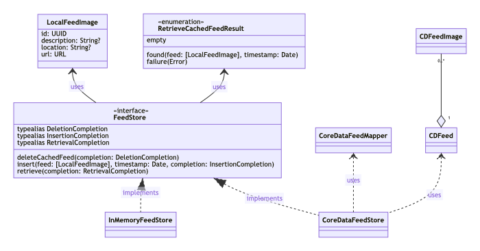

# The `FeedStore` challenge - iOSLeadEssentials.com


You are called to build your own persistence infrastructure implementation by creating a new component that conforms to the `<FeedStore>` protocol.

Your custom persistence infrastructure implementation can be backed by any persistence stack you wish, i.e. CoreData, Realm, in memory, etc, as shown in the diagram below.


## Instructions

1) Fork the latest version of this repository. Here's <a href="https://guides.github.com/activities/forking" target="_blank">how forking works</a>.

2) Open the `FeedStoreChallenge.xcodeproj` project on Xcode 12.2 (you can use other Xcode versions by switching to the appropriate branch, e.g., `xcode11`/`xcode12`).

3) Implement **one** `<FeedStore>` implementation of your choice (CoreData, Realm, InMemory, etc.).

4) Use the `Tests/FeedStoreChallengeTests.swift` to validate your implementation. Uncomment and implement one test at a time following the TDD process: Make the test pass, commit, and move to the next one.

5) If your implementation has failable operations (e.g., it might fail to load data from disk), uncomment and implement the failable test extensions at the bottom of the `Tests/FeedStoreChallengeTests.swift` test file. 

6) If your implementation persists data to disk (e.g., CoreData/Realm), you must use the `Tests/FeedStoreIntegrationTests.swift` to check this behavior. Uncomment and implement one test at a time following the TDD process: Make the test pass, commit, and move to the next one.

7) When all tests are passing and you're done implementing your solution, create a Pull Request from your branch to the main challenge repo. Use the name of your implementation as the title for the Pull Request, for example, **"CoreData implementation - Your name"**.

**8) Post a comment in the challenge page in the academy with the link to your PR, so we can review your solution and provide feedback.**


## Guidelines

1) Aim to commit your changes every time you add/alter the behavior of your system or refactor your code.

2) Aim for descriptive commit messages that clarify the intent of your contribution which will help other developers understand your train of thought and purpose of changes.

3) The system should always be in a green state, meaning that in each commit all tests should be passing.

4) The project should build without warnings.

5) The code should be carefully organized and easy to read (e.g. indentation must be consistent).

6) Make careful and proper use of access control, marking as `private` any implementation details that aren’t referenced from other external components.

7) Aim to write self-documenting code by providing context and detail when naming your components, avoiding explanations in comments.

8) Aim to declare dependencies explicitly, leveraging dependency injection wherever necessary.

9) Aim **not** to block the main thread - run expensive operations in a background queue.

Happy coding!

## Class Diagram



## Mocking CoreData PersistentStore

I spent some hours trying to mock the CoreData PersistentStore by creating a `NSIncrementalStore` subclass. Unfortunately, this is flaky is and reliable, as even if the docs state this is an abstract class, it has behavior we can't override.

```swift
class MockPersistentStore: NSIncrementalStore {
	
	static let storeType: String = "Tests.MockPersistentStore"
	
	static var mockRetrieveError: Error?
	static var mockInsertError: Error?
		
	override func loadMetadata() throws {
	}
	
	override class func metadataForPersistentStore(with url: URL) throws -> [String : Any] {
		return [NSStoreTypeKey: MockPersistentStore.storeType, NSStoreUUIDKey: ""]
	}
					
	override func execute(_ request: NSPersistentStoreRequest, with context: NSManagedObjectContext?) throws -> Any {
		switch (request, MockPersistentStore.mockRetrieveError, MockPersistentStore.mockInsertError) {
		case let (_ as NSFetchRequest<NSFetchRequestResult>, .some(retrievalError), _):
			throw retrievalError
		case let (_ as NSSaveChangesRequest, _, .some(insertionError)):
			throw insertionError
		default: break
		}
				
		return []
	}
	
	override func obtainPermanentIDs(for array: [NSManagedObject]) throws -> [NSManagedObjectID] {
		guard let firstID = array.first?.objectID else { return [] }
		return array.map { _ in firstID }
	}
}

...

NSPersistentStoreCoordinator.registerStoreClass(MockPersistentStore.self, forStoreType: MockPersistentStore.storeType)
try? addPersistentStore(ofType: MockPersistentStore.storeType, configurationName: nil, at: storeURL, options: nil)
```

Details here (not many references to this approach): https://stackoverflow.com/questions/9382151/core-data-unit-testing-unsure-how-to-trigger-error-case-in-executefetchrequest


