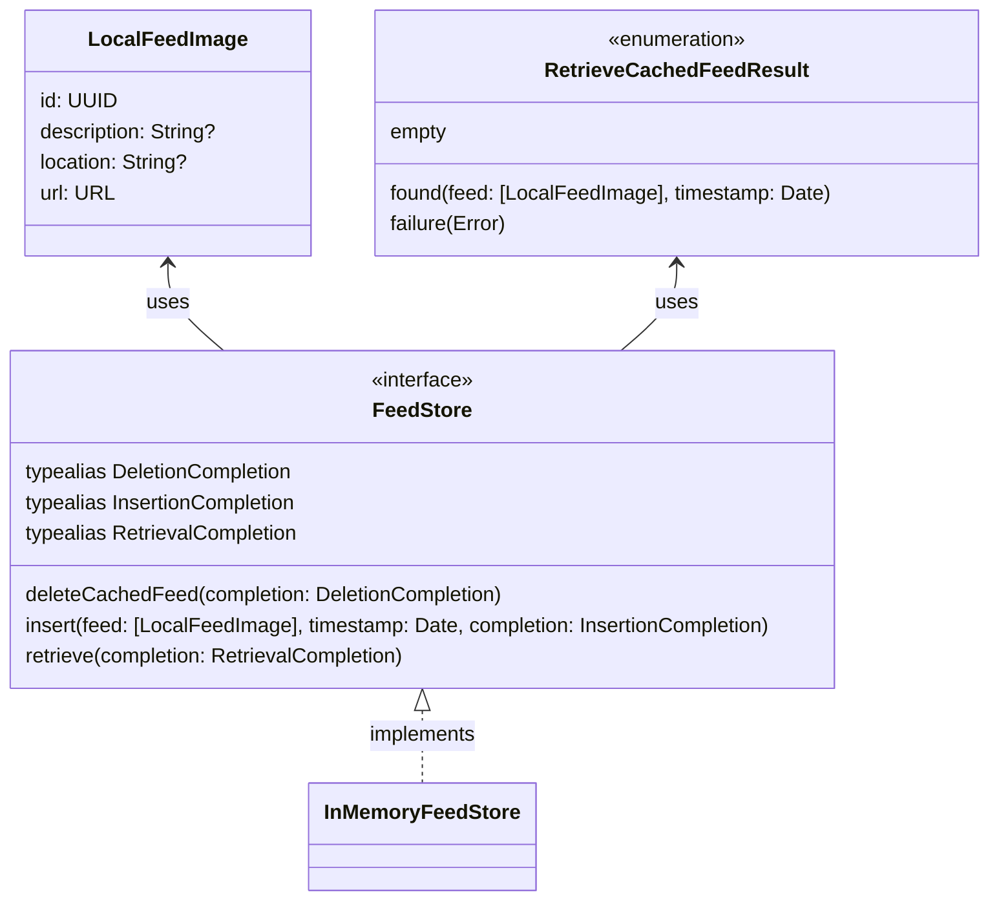

```mermaid
classDiagram

class LocalFeedImage {
  id: UUID
	description: String?
	location: String?
	url: URL
}

class RetrieveCachedFeedResult {
  <<enumeration>>
  empty
	found(feed: [LocalFeedImage], timestamp: Date)
	failure(Error)
}

class FeedStore {
  <<interface>>
  typealias DeletionCompletion
  typealias InsertionCompletion
  typealias RetrievalCompletion
  
  deleteCachedFeed(completion: DeletionCompletion)
  insert(feed: [LocalFeedImage], timestamp: Date, completion: InsertionCompletion)
  retrieve(completion: RetrievalCompletion)
}

LocalFeedImage <-- FeedStore : uses
RetrieveCachedFeedResult <-- FeedStore : uses
FeedStore <|.. InMemoryFeedStore : implements

```

